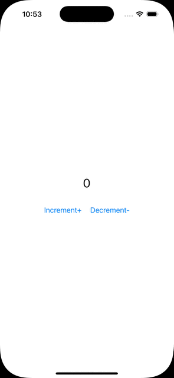

# Swift Counter App

The app has 2 buttons to increase/decrease a counter variable and a label to display the counter number.

There is a unit test written for one method in the **ContentViewModel**, all other tests are intentionally left out to test the test generation of Qodo Cover.



## Building and Running the Application
This guide describes how to build and run the iOS Counter app written in Swift

### Prerequisites
- Xcode 16+
- [slather](https://github.com/SlatherOrg/slather) to generate cobertura unit test report

### Steps to Run the Application

Run the following command to generate additional tests for ContentViewModel class

```sh
cover-agent \
  --source-file-path "templated_tests/swift_counter/swift_counter/ContentViewModel.swift" \
  --test-file-path "templated_tests/swift_counter/swift_counterTests/ContentViewModelTests.swift" \
  --project-root "templated_tests/swift_counter" \
  --code-coverage-report-path "templated_tests/swift_counter/.report/cobertura.xml" \
  --test-command "./slather.sh" \
  --test-command-dir "templated_tests/swift_counter" \
  --coverage-type "cobertura" \
  --desired-coverage 70 \
  --max-iterations 10 \
  --max-run-time 1000
```

Run the following command to generate additional tests for ObjCViewModel class

```sh
cover-agent \
  --source-file-path "templated_tests/swift_counter/swift_counter/ObjCViewModel.m" \
  --test-file-path "templated_tests/swift_counter/swift_counterTests/ObjCViewModelTests.m" \
  --project-root "templated_tests/swift_counter" \
  --code-coverage-report-path "templated_tests/swift_counter/.report/cobertura.xml" \
  --test-command "./slather.sh" \
  --test-command-dir "templated_tests/swift_counter" \
  --coverage-type "cobertura" \
  --desired-coverage 70 \
  --max-iterations 10 \
  --max-run-time 1000
```